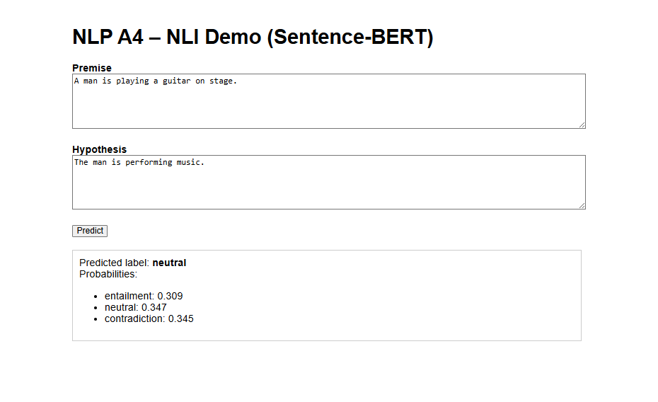
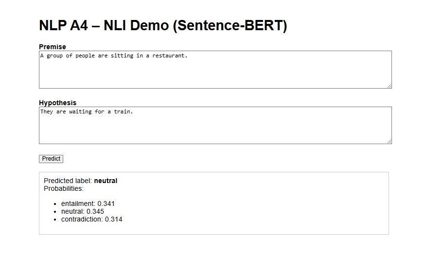
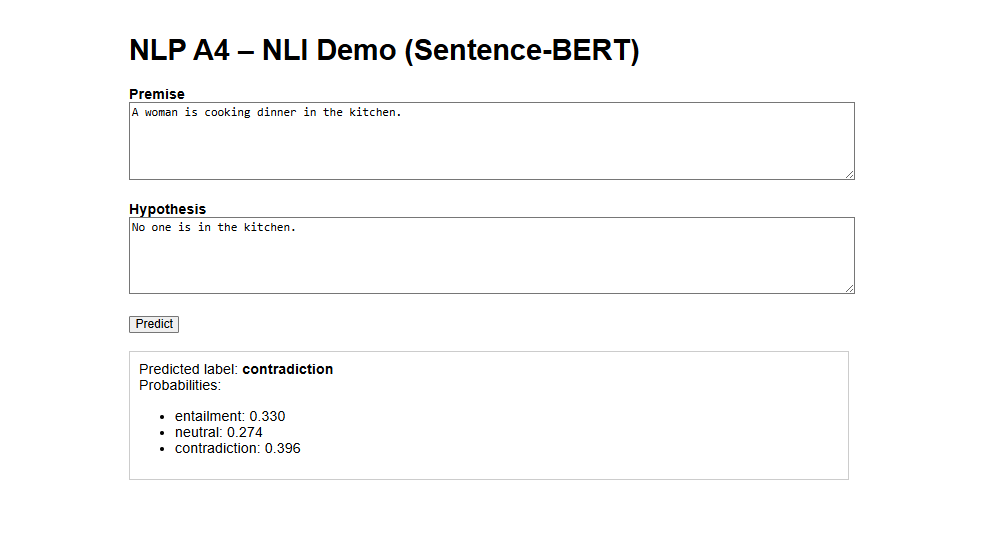

# NLP A4 – Do you AGREE?

This repository contains my implementation for the assignment **“A4 Do you AGREE?”** for the NLP course at AIT.  
The goal is to implement a small BERT model from scratch, adapt it to a Sentence-BERT style architecture for NLI, and prepare it for use in a simple web application.

---

## 1. Repository structure

```bash
.
├── .gitignore
├── README.md
├── app
│   ├── app.py
│   ├── model_architecture.py
│   └── templates
│       └── index.html
├── figure
│   ├── contradiction.png       
│   ├── entailment.png
│   └── neutral.png
├── model
│   ├── bert_pretrained_from_scratch.pt
│   └── sbert_sentence_encoder.pt
└── notebook
    └── code_1.ipynb
```

---

## 2. Task 1 – BERT from scratch (MLM + NSP)

**Objective:** Implement a small BERT-style encoder and pretrain it on a subset of BookCorpus using **Masked Language Modeling (MLM)** and **Next Sentence Prediction (NSP)**.

- **Dataset**
  - `bookcorpus`, `plain_text` from HuggingFace (with `trust_remote_code=True`).
  - Cleaned (lowercase, regex filtering, remove very short lines) and sampled **100k sentences** for efficiency.

- **Vocabulary & tokenization**
  - Custom word-level vocab built from the 100k-sentence corpus.
  - Special tokens: `[PAD]`, `[CLS]`, `[SEP]`, `[MASK]`, `[UNK]`.
  - Sentences converted to lists of token IDs (without CLS/SEP, added later in batching).

- **Pretraining objectives**
  - **NSP (Next Sentence Prediction):**
    - Positive pairs: B is the next sentence after A.
    - Negative pairs: B is a random sentence.
    - Input format: `[CLS] A [SEP] B [SEP]` with segment IDs 0 for A and 1 for B.
  - **MLM (Masked Language Modeling):**
    - Roughly 15% of tokens (excluding special tokens) selected as prediction targets.
    - 80% replaced by `[MASK]`, 10% by random token, 10% left unchanged.

- **Model architecture (in `notebook/code_1.ipynb`)**
  - Encoder-only Transformer:
    - 2 layers, hidden size 256 (`d_model`), 4 attention heads.
    - FFN size `4 × d_model`, max sequence length 128, 2 segment types.
  - Heads:
    - **MLM head:** Linear → GELU → LayerNorm → decoder (shared weights with token embedding).
    - **NSP head:** Linear + Tanh on `[CLS]` → linear classifier (2 classes).

- **Training setup**
  - 3 epochs, 1000 steps/epoch, batch size 16.
  - Optimizer: Adam, learning rate 1e-4.
  - Loss = MLM loss + NSP loss (CrossEntropy for both).
  - Training loss decreases from ~6.37 → ~2.97, indicating successful pretraining.

- **Checkpoint**
  - Saved to: `model/bert_pretrained_from_scratch.pt`.

---

## 3. Task 2 – Sentence Embedding with Sentence-BERT

**Objective:** Reuse the pretrained BERT encoder from Task 1 as a sentence encoder, build a Siamese **Sentence-BERT**-style model, and fine-tune it on NLI (SNLI + MNLI) using a softmax classification objective.

- **Datasets**
  - **SNLI** (`snli`) and **MNLI** (`glue`, `mnli`) from HuggingFace.
  - SNLI: filter out examples with `label = -1` (no gold label).
  - MNLI: remove `idx` column.
  - Merge into a single `DatasetDict` with shuffled subsets:
    - Train: 10,000 examples.
    - Validation: 2,000 examples.
    - Test: 2,000 examples.

- **Preprocessing**
  - Simple whitespace tokenizer, reusing the Task 1 vocab (with `[UNK]`).
  - Apply same cleaning as Task 1 (lowercase, regex).
  - Truncate to `max_len - 2` to allow `[CLS]` and `[SEP]` later.
  - Store `input_ids_a` (premise), `input_ids_b` (hypothesis), and `label`.

- **DataLoader**
  - Custom `collate_fn` pads each batch to the max length in that batch using `[PAD]`.
  - Returns tensors:
    - `input_ids_a`, `input_ids_b`: `[B, L]`
    - `labels`: `[B]`.

- **Sentence encoder**
  - Add `[CLS]` and `[SEP]` to each sentence: `[CLS] tokens [SEP]`.
  - Build `segment_ids` (all zeros, single-sentence).
  - Pass through BERT encoder to get hidden states.
  - Apply **mean pooling** over non-PAD tokens → sentence embedding `u` or `v`.

- **SBERT-style classifier**
  - For each pair (premise, hypothesis), compute embeddings `u` and `v`.
  - Build feature vector: `[u; v; |u − v|]` (concatenate along last dimension).
  - Apply a linear layer → logits for 3 NLI labels (entailment, neutral, contradiction).

- **Training setup**
  - Load encoder weights from `bert_pretrained_from_scratch.pt`.
  - Optimizer: Adam, learning rate 2e-5.
  - Batch size 32, epochs 3.
  - Loss: CrossEntropyLoss on the 3-way NLI labels.
  - Validation accuracy after training: around **0.41** on the held-out validation subset.

- **Checkpoint**
  - Saved to: `model/sbert_sentence_encoder.pt` (full SBERT classifier).

---

## 4. Task 3 – Evaluation and Analysis

**Objective:** Evaluate the Sentence-BERT classifier on the test set and analyse limitations and potential improvements.

- **Evaluation procedure**
  - Use the merged SNLI+MNLI test split (subset).
  - Collect predictions and labels from the trained SBERT model.
  - Use `sklearn.metrics.classification_report` with labels `[0, 1, 2]` and class names:
    - `["entailment", "neutral", "contradiction"]`.
  - Explicitly filter out any remaining `label = -1` before computing metrics to avoid mismatch errors.

- **Example classification report (subset test set, 1003 examples)**

```text
precision    recall  f1-score   support

   entailment       0.44      0.79      0.57       365
      neutral       0.46      0.39      0.42       309
contradiction       0.42      0.11      0.17       329

     accuracy                           0.44      1003
    macro avg       0.44      0.43      0.39      1003
 weighted avg       0.44      0.44      0.39      1003
```

- **Interpretation**
  - Good recall for entailment (0.79) → model finds many entailment pairs, but precision is moderate.
  - Neutral and contradiction are more challenging, especially contradiction (recall 0.11).
  - Overall accuracy ~0.44 is above random (~0.33) but far from state-of-the-art, which is expected given:
    - Small encoder (2 layers, 256 hidden).
    - Limited pretraining data (100k sentences).
    - Simple whitespace tokenization.
    - NLI training on a subset only.

- **Limitations & potential improvements**
  - **Model & data:**
    - Increase encoder depth/width and pretraining data size.
    - Use full SNLI/MNLI instead of small subsets.
  - **Tokenization:**
    - Replace word-level tokenizer with subword (WordPiece/BPE) using HuggingFace tokenizers.
  - **Objective & training:**
    - Explore contrastive learning (e.g., SimCSE) to improve sentence embeddings.
    - Introduce learning rate schedulers, early stopping, or regularization for better generalization.

---

## 5. `app/model_architecture.py`

The `app/model_architecture.py` file contains the reusable architecture for the web app:

- **Helper functions**
  - `get_attn_pad_mask(seq_q, seq_k, pad_id)`
  - `build_sentence_batch(input_ids_batch, cls_id, sep_id)`
  - `mean_pool(hidden_states, input_ids, pad_id)`

- **Core classes**
  - `Embedding`: token + position + segment embeddings with LayerNorm.
  - `ScaledDotProductAttention`, `MultiHeadAttention`, `PoswiseFeedForwardNet`, `EncoderLayer`.
  - `BERT`: encoder with `encode()` and standard `forward()` (MLM + NSP), parameterised by `pad_id`.
  - `SentenceEncoder`: wraps BERT to produce sentence embeddings using CLS/SEP and mean pooling.
  - `SBERTClassifier`: SBERT-style NLI classifier that takes `[u; v; |u − v|]` as input.

These components are designed to be imported from the web application and used together with the trained checkpoints in `model/`.

---

## 6. How to run

1. **Reproduce training & evaluation (Task 1–3)**  
   - Open `notebook/code_1.ipynb`.  
   - Run the cells sequentially to:
     - Pretrain BERT (Task 1),
     - Fine-tune SBERT on NLI (Task 2),
     - Generate evaluation metrics (Task 3).

2. **Use pretrained models in your app**
   - Import architectures from `app/model_architecture.py`.
   - Load weights from:
     - `model/bert_pretrained_from_scratch.pt`
     - `model/sbert_sentence_encoder.pt`
   - Wire them to your web application (Task 4).

   **Example of app interface**
   - entailment:

     

   - neutral:

     

   - contradiction:

     
